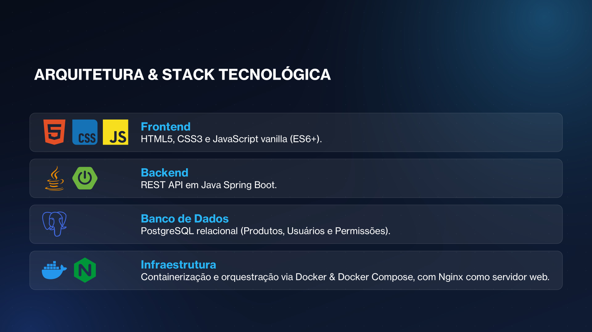
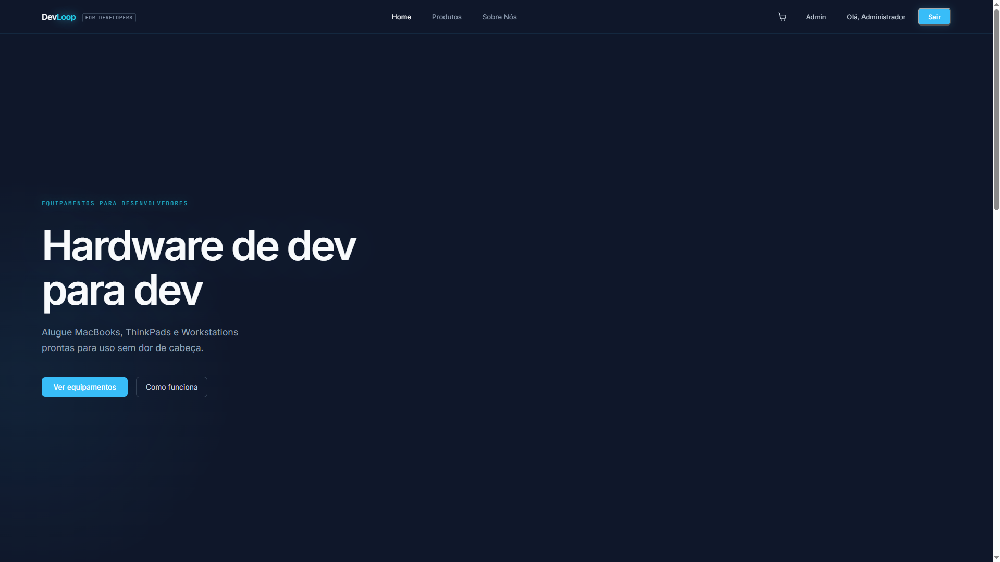
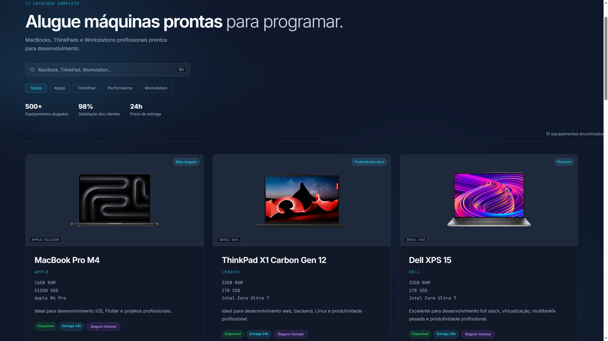
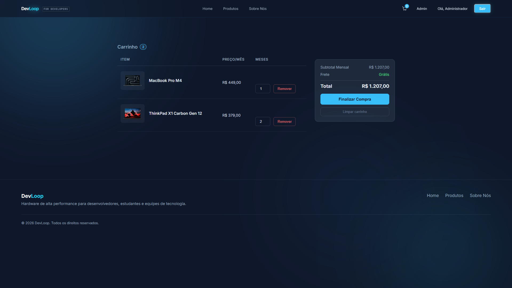
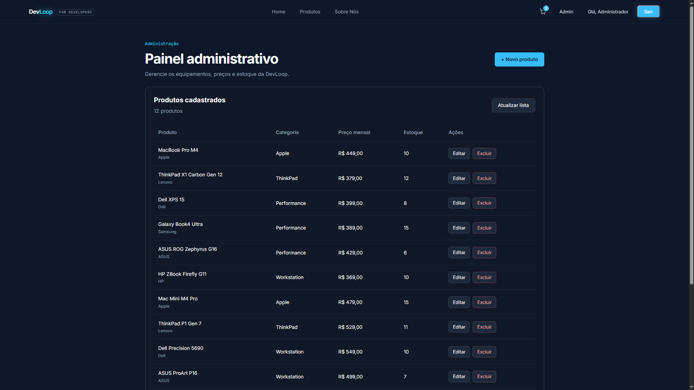

# DevLoop

Sistema de locação de equipamentos de alta performance voltado para desenvolvedores, estudantes, profissionais de tecnologia e empresas.

A plataforma permite navegar por um catálogo de notebooks, workstations e computadores premium, visualizar especificações técnicas, realizar autenticação de usuários, gerenciar pedidos e administrar produtos através de um painel administrativo.

---

## Arquitetura & Stack Tecnológica



---

## Tecnologias Utilizadas

- HTML5
- CSS3
- JavaScript
- Java
- Spring Boot
- PostgreSQL
- Docker
- Docker Compose
- Nginx

---

## Funcionalidades

### Área Pública
- Página inicial institucional
- Cadastro de usuários
- Login e autenticação
- Catálogo de produtos
- Busca e filtros por categoria
- Página de detalhes dos produtos
- Página Sobre Nós

### Área do Cliente
- Carrinho de compras
- Checkout
- Pagamento via Pix
- Pagamento via Cartão
- Registro de pedidos

### Área Administrativa
- Painel administrativo
- Cadastro de produtos
- Edição de produtos
- Remoção de produtos
- Gerenciamento do catálogo

---

## Arquitetura do Projeto

O sistema foi desenvolvido seguindo uma arquitetura em camadas:

- Frontend responsável pela interface do usuário
- Backend construído com Spring Boot utilizando arquitetura REST
- Banco de dados PostgreSQL para persistência das informações
- Docker Compose para orquestração dos serviços
- Nginx como servidor web para disponibilização do frontend

---

## Estrutura da Aplicação

```text
DevLoop/
│
├── frontend/
│   ├── assets/
│   ├── css/
│   ├── js/
│   └── pages/
│
├── backend/
│   ├── src/
│   └── pom.xml
│
├── database/
│
├── docker-compose.yml
│
└── README.md
```

## Como Executar o Projeto

### Pré-requisitos

- Docker
- Docker Compose

### Executando

```bash
docker compose up -d
```

Após a inicialização:

Frontend:

```text
http://localhost
```

Backend:

```text
http://localhost:8080
```

Swagger/OpenAPI:

```text
http://localhost:8080/swagger-ui.html
```

---

## Documentação da API

A API REST foi documentada utilizando OpenAPI (Swagger), permitindo visualizar e testar os endpoints diretamente pela interface web.

Principais recursos:

- Autenticação de usuários
- Gerenciamento de produtos
- Gerenciamento de pedidos

---

## Capturas de Tela

### Página Inicial



### Catálogo de Produtos



### Carrinho



### Painel Administrativo



---

## Equipe

- Bruno de Jesus Oliveira
- Bruno Nagasawa Cruz
- Maria Eduarda Pimentel Hazelman de Souza
- Sabrina Barbosa dos Santos de Matos
- Mariana Esteves Porto

---

## Projeto Acadêmico

Projeto desenvolvido para a disciplina de Desenvolvimento Backend do curso de Análise e Desenvolvimento de Sistemas da Universidade Veiga de Almeida.
